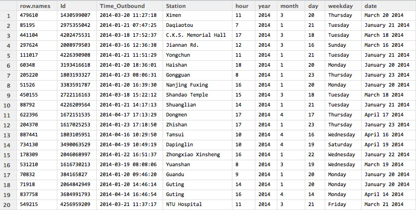
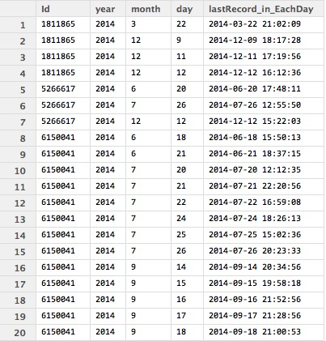
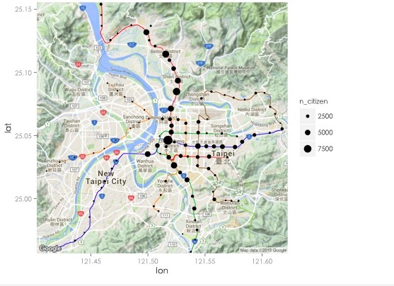
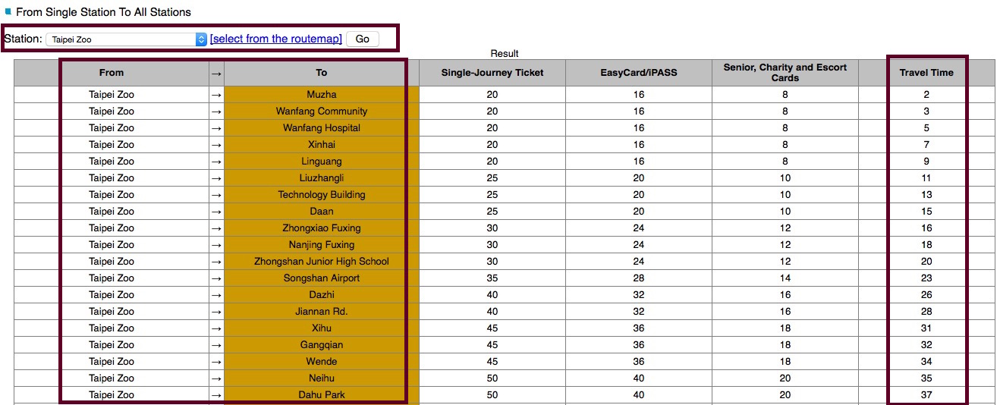
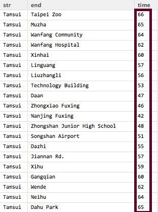
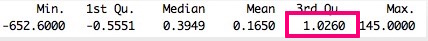
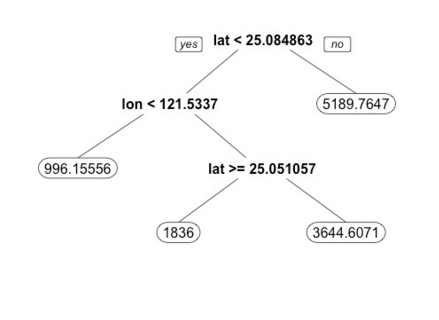
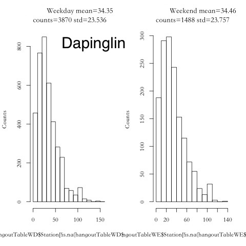

## Motivation

* Question: Where is the best place to locate the Elderly Sports Center?
* Assumption: The more energetic seniors live there, the more appropriate will be <br/>

* Types of metro cards in Taipei: <br/>
  * Adult: Standard fare for the general public <br/>
  * Student: For registered students only <br/>
  * `Senior: seniors aged over 65` <br/>

* Leverege data from Metro Cards to solve this problem

---
## The Main Idea

* Leverage data from Metro Cards to find out which areas of Taipei City are most populated by energetic seniors

* The area with the most eneretic seniors might be the best place to locate the elderly sports center </br>

</img>


---
## Outline

Raw Data Demonstrating

Residence Tagging

Energetic Levels Measurement  

Preprocessing

CART Model Building

--- .dark .segue
## Raw Data Demonstrating 

---
## Raw Data


</img>

--- .dark .segue

## Residence Tagging

---
## Time Information Extraction
```{r , eval=FALSE}
library(lubridate)
rawData1$hour <- hour(rawData1$Time_Outbound)
rawData1$year <- year(rawData1$Time_Outbound)
rawData1$month <- month(rawData1$Time_Outbound)
rawData1$day <- day(rawData1$Time_Outbound)
rawData1$weekday <- weekdays(rawData1$Time_Outbound)
rawData1$date <- format(rawData1$Time_Outbound, format="%B %d %Y")

```
</img>

---
## Keep the last record of each user each day
```{r , eval=FALSE}
library(dplyr)
lastRecord <- summarise(group_by(rawData1,Id,year,month,day),
                      lastRecord_in_EachDay= max(Time_Outbound))
```
</img>


---
## Merge it with raw data to find the station name
```{r , eval=FALSE}
lastRecord_merged <- merge(rawData1,lastRecord, by.x = c("Id","Time_Outbound"),
                by.y = c("Id","lastRecord_in_EachDay"),all.y = T)
```
</img>

---

## Where do those users live?
```{r , eval=FALSE}
most_fequent <- function(x){
  return(names(sort(table(x),decreasing=TRUE)[1]))
}
liveTable <- aggregate( Station~ Id, lastRecord_merged, most_fequent)
```
</img>

---

## Combined with Google Map

```{r , eval=FALSE}
library(ggmap)
map <- qmap(location = c(lon = 121.512386, lat = 25.056269), zoom = 12)
map +geom_point(aes(x=lon, y=lat,size=n_citizen),color="black",data= metro)
```
</img>

--- .dark .segue
## Energetic Levels Measurement 

--- 

## How to determine whether a senior is energetic or not?

</img>

`Assumption: The longer they travel, the more energetic they might be `


---
## Energetic Levels Measurement 

1. `The website of the Metro` 
2. Using a parser written in Python

</img>

---
## Energetic Levels Measurement

1. The website of the Metro
2. `Using a parser written in Python`


</img>

--- 
## Energetic Levels Measurement

With the data parsed down and the raw data, we could 
calculate travel time each senior spend each day to represent his/her energetic level

Ex: the user,2766995571, who lives in Tucheng. And the total time the senior spend on traveling on 2014/1/19 are sum of traveling time from Tucheng to Technology Building and from Technology Building back to Tucheng, which is 34 + 34 = 68 min

`Tucheng -> Technology Building -> Tucheng`

</img>

--- 

## Energetic Levels Measurement

# Result:
# The travel time the seniors lived around Tucheng station spent each day</br>

</img>

---
## Energetic Levels Measurement
# Now we get:

1. Where those seniors live
2. How long each senior spends on Metro

--- .dark .segue

## Preprocessing

---
## Preprocessing

We plot these information on GoogleMap</br>
`the bigger the dot is, the more average travel time those seniors live there spent`

```{r, eval=FALSE}
library(ggmap)
map <- qmap(location = c(lon = 121.512386, lat = 25.056269), zoom = 12)
map +geom_point(aes(x=lon, y=lat,size=AvgTravalTime),color='black',data= metro)
```
</img>

---

## Preprocessing

* Of course those people live in outlying areas spend more time on commuting.... </br>
* `Travel Time =  Outlying Degree & Energetic Levels`

</img>

---
## Preprocessing
* `Travel Time =  Outlying Degree & Energetic Levels`
* We need to find a adjustment variable which could stand for `the outlying degree` to adjust the travel time based on different stations.

</img>

---
## Preprocessing

* Calculate `"Outlyzing Degree"` for each station, `the average travel time between it to any other stations.`<br />
* Take two stations as examples: Taipei Main Station(central):16.30435 (min) and Tamsui(outlying):46.94565 (min)<br />
* The travel time a senior spend need to divide by its corresponding outlyzing degree(based <br />
on where he/she lives) to get `the adjusted travel time`, which could actually show the energetic level of each senior.


</img>
</img>

---
## Preprocessing

`Another thing is needed`

</img>


---
## Normalization 

</img>

---
## Preprocessing (Code)

```{r ,eval=FALSE}
all=data.frame(TravelTime=0,station="")
files <- list.files("~/Desktop/MetroCard/TravelTime/")
for(f in files){
  tmp <- read.csv(paste0("~/Desktop/MetroCard/TravelTime/",f),header = T)
  tmp$station <- strsplit(f,".csv")[[1]]
  all <- rbind(all,tmp[!is.na(tmp$TravelTime),c("TravelTime","station")])
}
all = all[-1,]
all$Normalized.TravelTime <- normalize(all$TravelTime)
all$AdjedAvgTravelTime.Normalized <- 0
metro$adjV.Normalized <- normalize(metro$TravalTime)
for(i in unique(as.character(metro$name))){
  all[all$station==i,"AdjedTravelTime.Normalized"] <- all[all$name==i,"Normalized.Dist"]/metro$adjV.Normalized[metro$name==i]
}
summary(all$AdjedTravelTime.Normalized)
```
</img>

---
## Preprocessing
```{r ,eval=FALSE}
for(i in unique(as.character(metro$name))){
  metro$n_Energetic.normalized[metro$name==i] <- 
    sum(all$adjedTravelTime.Normalized[all$station==i] > 1.0260)
}
p = map + geom_point(aes(x=lon, y=lat,size=n_Energetic.normalized),
                     col =heat.colors(1), data= metro)

```

</img>

---
## Preprocessing
1. Try to build a model to seperate all of Taipei City into high or low populated zones by energetic seniors
2. Choose CART (Classification and Regression Trees), becasue it could capture the non-linear characteristic and is interpretive

--- .dark .segue

## Model Building

---
## Model Building

```{r ,eval=FALSE}
tr.control = trainControl(method = "cv", number = 2)
cp.grid = expand.grid( .cp = (0:15)*0.001)
tr = train(n_Energetic.normalized ~ lat + lon, data = metro, method = "rpart",
           trControl = tr.control, tuneGrid = cp.grid)
best.tree = tr$finalModel
prp(best.tree, digits = 8)

```
</img>

---
## Model Building
```{r, eval=FALSE}
p = map + geom_point(aes(x=lon, y=lat,size=mrt$n_Energetic.normalized), 
                     col =heat.colors(1), data= metro)
```
</img>
</img>

--- .dark .segue

## Few more things....


---
## Probability Distribution of travel time each senior spend (each day) for each station 
</img>


---

## HeatMap for each station

weekdays v.s hours

</img>

---
## Stability of outbound counts for each station 

* Each line stand for each day
* Stable v.s Unstable

</img>
</img>

---

</img>


