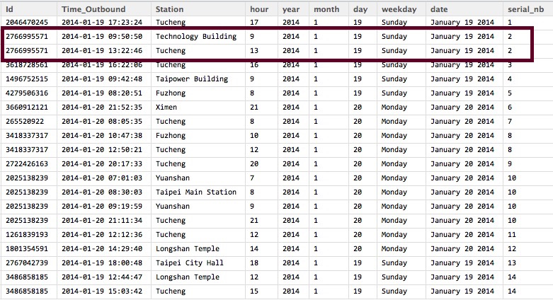

## Leverage data from Easy Card to find out the potential demand of senior citizens for excercising

</img>


---
## Outline

Sampling Process

Residence Tagging

Moving Range Measurement 

Preprocessing

CART Model Building

--- .dark .segue
## Sampling Process

---
## Raw Data


</img>

---
## Sampling Process

Season | Week | Duration
----|------|----
S1 | week 1  | 1/19-1/25
S1 | week 2  | 3/16-3/22
S2 | week 3  | 4/13-4/19
S2 | week 4  | 6/15-6/21
S3 | week 5  | 7/20-7/26
S3 | week 6  | 9/14-9/20
S4 | week 7  | 10/19-10/25
S4 | week 8  | 12/7-12/13

# *Not include Special Date、Typhoon、National Holiday


# * TimeStamp: Out of Station 

--- .dark .segue

## Residence Tagging

---
## Time Information Extracting 

```r
rawData1$hour <- hour(rawData1$Time)
rawData1$year <- year(rawData1$Time)
rawData1$month <- month(rawData1$Time)
rawData1$day <- day(rawData1$Time)
rawData1$weekday <- weekdays(rawData1$Time)
rawData1$date <- format(rawData1$Time, format="%B %d %Y")
```
</img>

---
## Left the lastest record of each user each day

```r
latest_d <- summarise(group_by(rawData1,Id,year,month,day),latest_day= max(Time))
```
</img>


---
## Merge it with raw data to find the station name

```r
latest <- merge(rawData1,latest_d, by.x = c("Id","Time"),by.y = c("Id","latest_day"),
                all.y = T)
```
</img>

---

## Where do those users live in?

```r
most_fequent <- function(x){
  return(names(sort(table(x),decreasing=TRUE)[1]))
}
latest_f <- aggregate( Station~ Id, latest, most_fequent)
```
</img>

---

## Combined with Google Map


```r
map +geom_point(aes(x=lon, y=lat,size=n_citizen),color="black",data= mrt)+
  theme_grey(base_family="STHeiti")
```
</img>

--- .dark .segue
## Moving Range Measurement 

--- 
## Moving Range Measurement 

1. `The data from website of MRT` 
2. Parse them down by a parser

</img>

---
## Moving Range Measurement 

1. The data from website of MRT 
2. `Parse them down by a parser`

</img>
</img>

--- 
## Moving Range Measurement 

Combined the parsed data with the raw data

`Ex: the user,1625328709, who lives in 古亭. And the total time he/she spend on traveling on 2014/1/19 are sum of traveling time from 古亭 to 台北車站 and from 台北車站 to 古亭, which is 7 + 7 = 14 min`

</img>

--- 

## Moving Range Measurement 

# Result:

</img>

---
## Moving Range Measurement 
# Now we get:

1. Where those user live in.
2. How long each user spend on MRT.

--- .dark .segue

## Preprocessing

---
## Preprocessing

First, we plot those stations with average 


```r
map +geom_point(aes(x=lon, y=lat,size=AvgDist),color='black',data= mrt)+
  theme_grey(base_family="STHeiti")
```
</img>

---
## Preprocessing

keep those above median 


```r
map +geom_point(aes(x=lon, y=lat,size=AvgDist),color='black',data= 
  mrt[mrt$AvgDist> median(mrt$AvgDist),])+theme_grey(base_family="STHeiti")
```
</img>

---
## Preprocessing

`Of course that people live in these areas spend more time on commuting....`


```r
map +geom_point(aes(x=lon, y=lat,size=AvgDist),color='black',data= 
  mrt[mrt$AvgDist> median(mrt$AvgDist),])+theme_grey(base_family="STHeiti")
```
</img>

---
## Preprocessing

`We need to find some adjustment variable to adjust the traveling time of different station.`

</img>

---
## Preprocessing

`The Average traveling Time to each other Stations.`<br />
`For example: 台北車站:16.30435 (min) and 淡水:46.94565 (min)`<br />
`By dividing this adjusting factor, we could realize the where the real energetic senior citizens lived in.`

</img>
</img>

---
## Preprocessing

Calculate the Benchmark (3rd Qu.)


```r
tmp=0
files <- list.files("~/Desktop/悠遊卡/EasyCard/量化移動範圍_表/")
for(f in files){
  tmp1 <- read.csv(paste0("~/Desktop/悠遊卡/EasyCard/量化移動範圍_表/",f),header = T)
  ind <- which(mrt$name==strsplit(f,".csv")[[1]])
  tmp <- c(tmp,(tmp1$Station[!is.na(tmp1$Station)]/ mrt$adjV[ind]))
}
summary(tmp[-1])
```

</img>

---
## Preprocessing

Calculate number of energetic senior citizens

```r
files <- list.files("~/Desktop/悠遊卡/EasyCard/量化移動範圍_表/")
for(f in files){
  tmp <- read.csv(paste0("~/Desktop/悠遊卡/EasyCard/量化移動範圍_表/",f),header = T)
  ind <- which(mrt$name==strsplit(f,".csv")[[1]])
  mrt$n_Energetic[ind] <- sum((tmp1$Station[!is.na(tmp1$Station)]/ mrt$adjV[ind]) > 1.698)
}
```

---
## Plot it on GoolgeMap


```r
map +geom_point(aes(x=lon, y=lat,size=n_Energetic),color='black',data= 
  mrt)+theme_grey(base_family="STHeiti")
```
</img>

---

## Preprocessing
1. Try to use predicative model to seperate the whole Taipei City in to different zones with high populated energetic senior citizen
2. Choose CART (Classification and Regression Trees), becasue it could capture the non-linear characteristic and is interpretive

--- .dark .segue

## Model Building

---
## Model Building


```r
tr.control = trainControl(method = "cv", number = 2)
cp.grid = expand.grid( .cp = (0:15)*0.001)
tr = train(n_energetic ~ lat + lon, data = mrt, method = "rpart", 
           trControl = tr.control, tuneGrid = cp.grid)
best.tree = tr$finalModel
prp(best.tree, digits = 8)
```

</img>

---
## Model Building

# Hot Zone:

```r
p = map + geom_point(aes(x=lon, y=lat,size=n_Energetic), col ='black', data= mrt)

p+geom_vline(xintercept = 121.50728) +geom_hline(yintercept = 25.01963) + 
  geom_hline(yintercept = 25.062953)+geom_vline(xintercept = 121.55131)
```

</img>


---
## Something is still going wrong

`Another preprocessing is Needed`

</img>


---
## Normalization 

</img>

---
## Preprocessing Again


```r
tmp=data.frame(Station=0,name="")
files <- list.files("~/Desktop/悠遊卡/EasyCard/量化移動範圍_表/")
for(f in files){
  tmp1 <- read.csv(paste0("~/Desktop/悠遊卡/EasyCard/量化移動範圍_表/",f),header = T)
  tmp1$name <- strsplit(f,".csv")[[1]]
  ind <- which(mrt$name==strsplit(f,".csv")[[1]])
  tmp <- rbind(tmp,tmp1[!is.na(tmp1$Station),c("Station","name")])
}
tmp = tmp[-1,]
tmp$Normalized.Dist <- normalize(tmp$Station)
tmp$AdjDist.Normalized <- 0

for(i in unique(as.character(mrt$name))){
  tmp[tmp$name==i,"AdjDist.Normalized"] <- tmp[tmp$name==i,"Normalized.Dist"]/mrt$adjV.Normalized[mrt$name==i]
}
summary(tmp$AdjDist.Normalized)
```
</img>

---
## Preprocessing Again

```r
for(i in unique(as.character(mrt$name))){
  mrt$n_Energetic.normalized[mrt$name==i] <- 
    sum(tmp$AdjDist.Normalized[tmp$name==i] > 1.0260)
}
p = map + geom_point(aes(x=lon, y=lat,size=mrt$n_Energetic.normalized),
                     col =heat.colors(1), data= mrt)
```

</img>

---
## Model Building Again


```r
tr.control = trainControl(method = "cv", number = 2)
cp.grid = expand.grid( .cp = (0:15)*0.001)
tr = train(n_Energetic.normalized ~ lat + lon, data = mrt, method = "rpart",
           trControl = tr.control, tuneGrid = cp.grid)
best.tree = tr$finalModel
prp(best.tree, digits = 8)
```
</img>

---
## Model Building Again

```r
p = map + geom_point(aes(x=lon, y=lat,size=mrt$n_Energetic.normalized), 
                     col =heat.colors(1), data= mrt)
```
</img>
</img>

---
</img>


